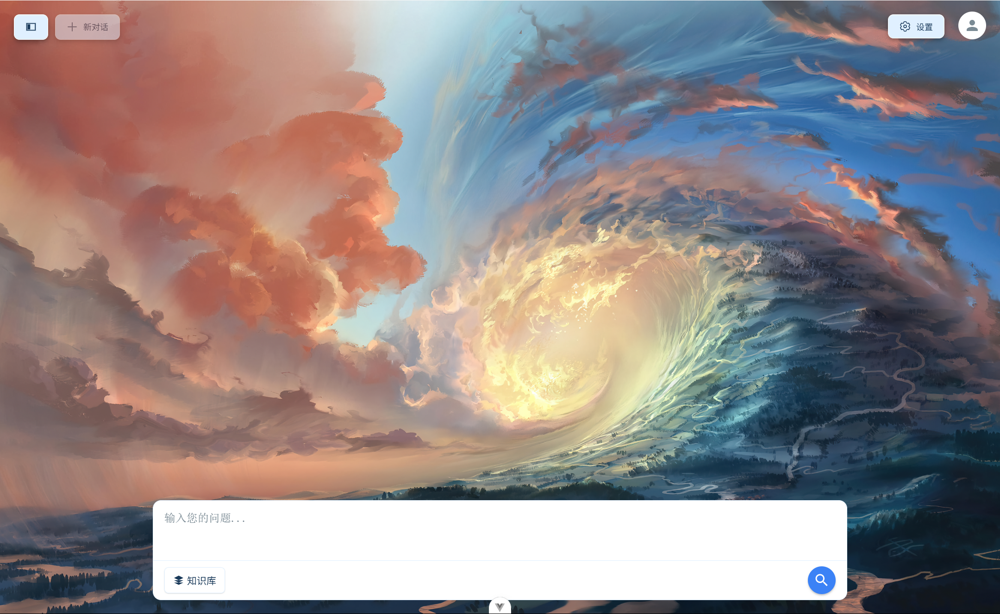
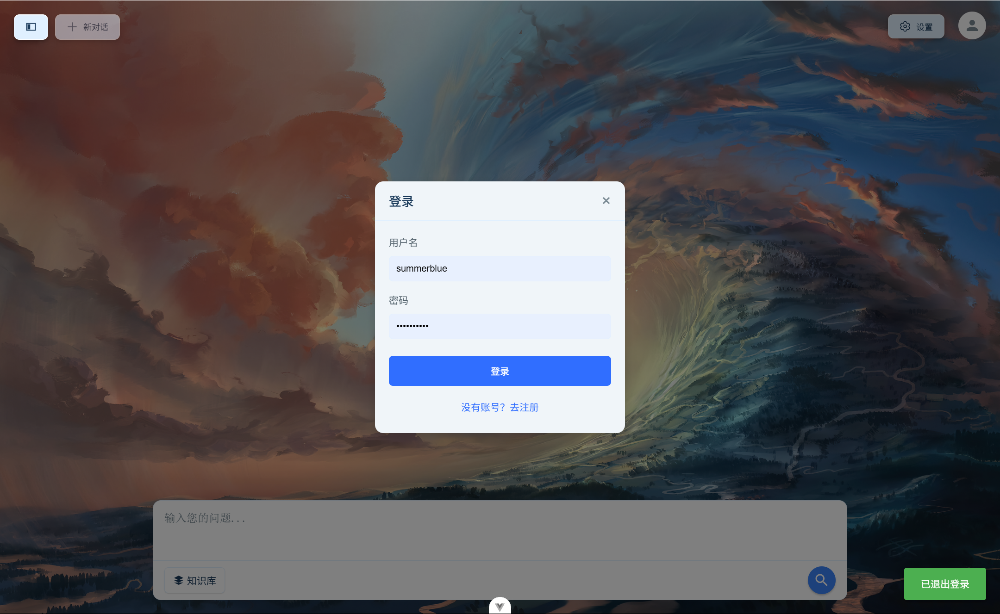
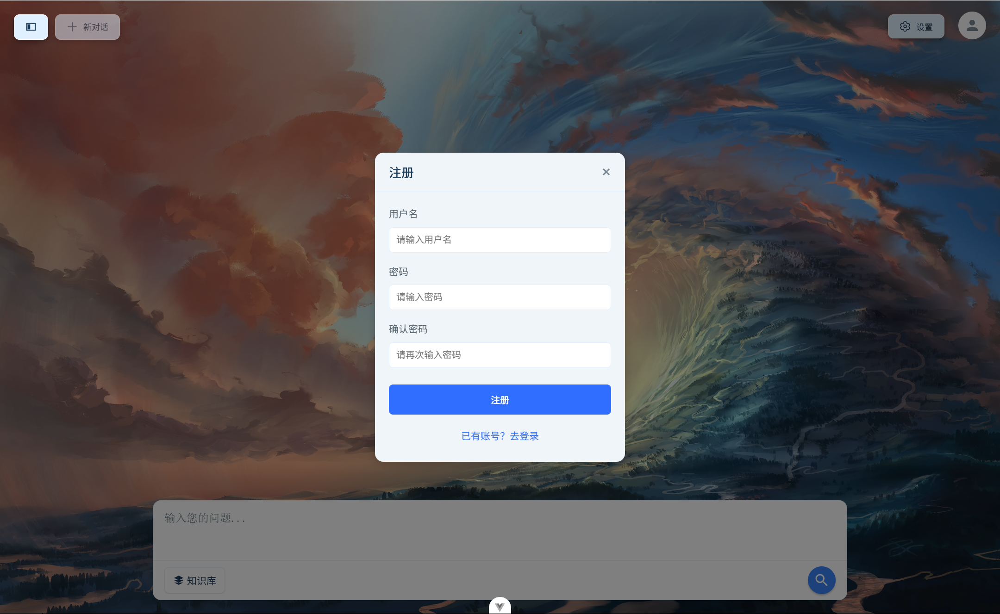
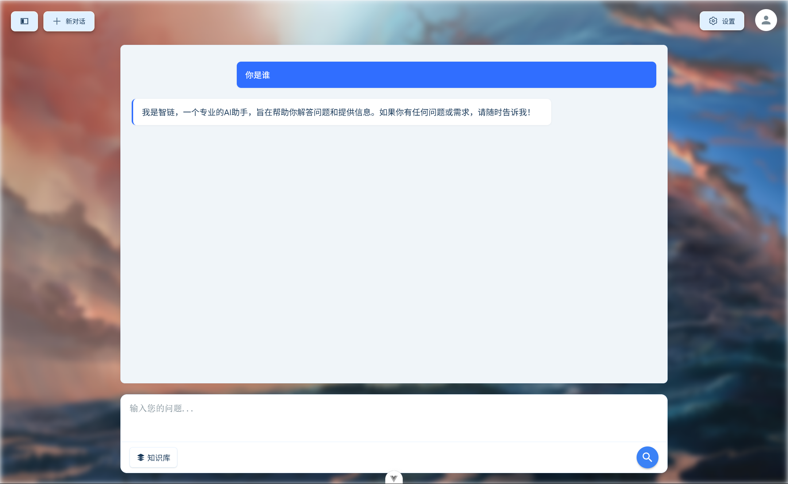
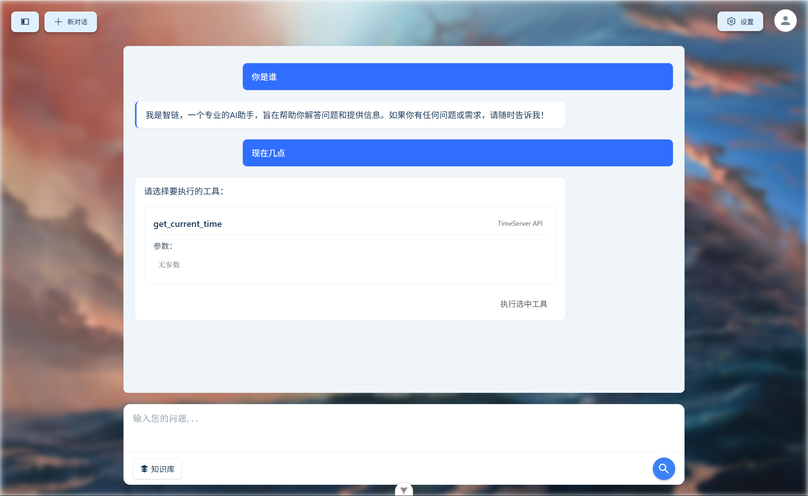
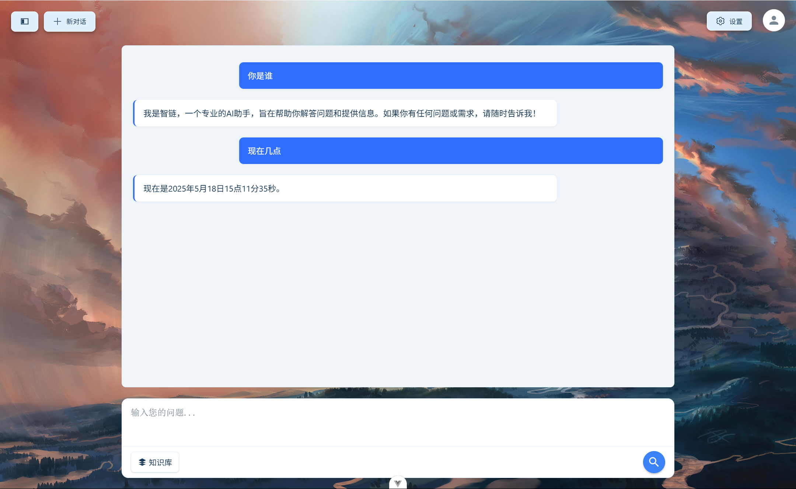
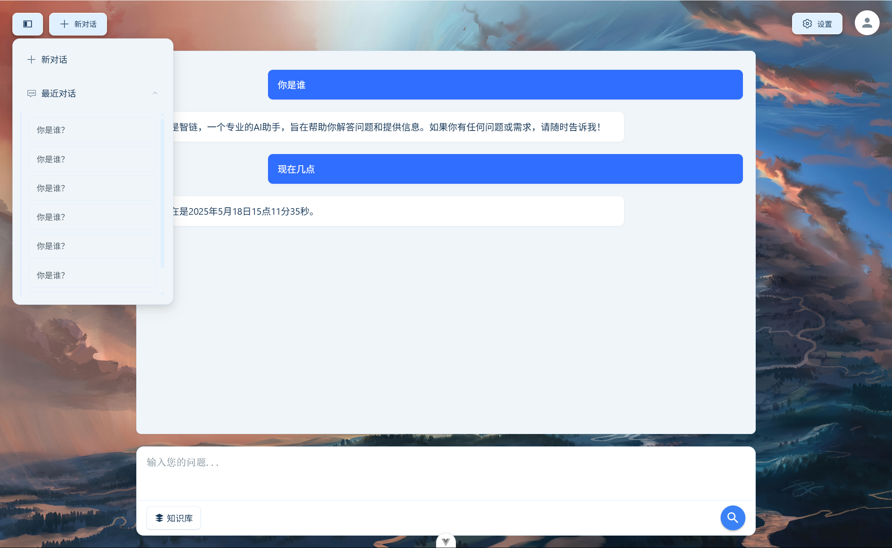
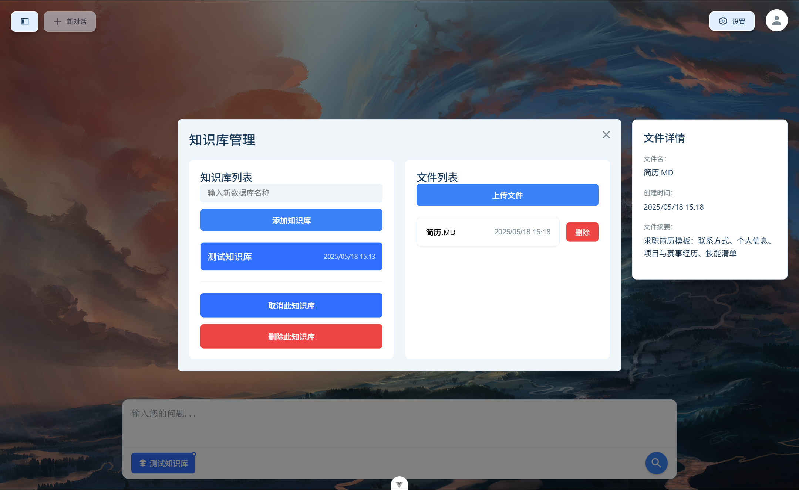
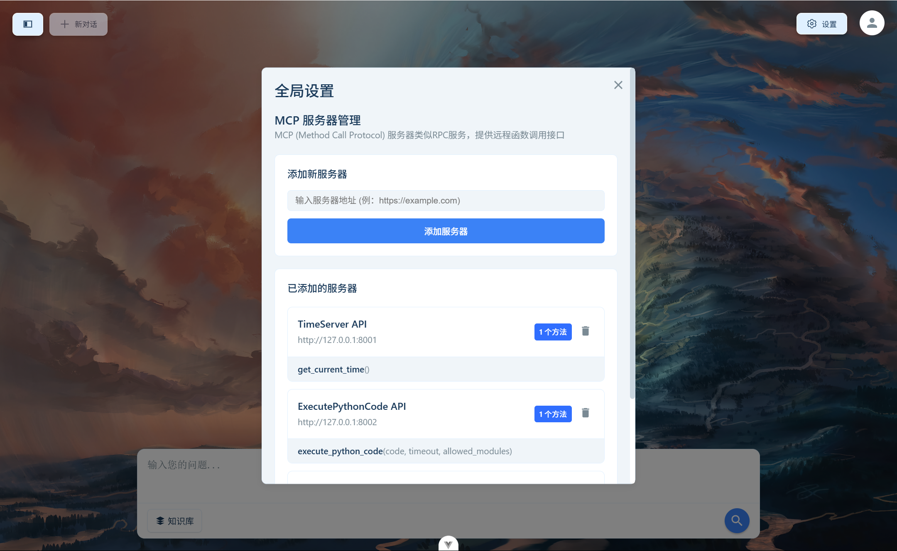

# Agent Reborn

一个基于 Vue.js 的智能代理应用，支持聊天、知识库管理和工具调用功能。本项目旨在提供一个现代化的智能代理平台，帮助用户更高效地管理和使用 AI 代理。

## 🌟 功能特点

- 💬 智能聊天界面
  - 支持多轮对话
  - 实时消息推送
  - 对话历史记录
- 📚 知识库管理
  - 文档上传和管理
  - 知识检索
  - 智能问答
- 🛠️ 工具调用
  - 内置多种实用工具
  - 自定义工具扩展
  - 工具使用统计
- 👤 用户系统
  - 用户注册/登录
  - 个人设置
  - 使用记录

## 📸 界面展示

### 首页


### 用户系统
#### 登录面板


#### 注册面板


### 聊天功能
#### 普通问答


#### 工具调用


#### 工具调用完成


### 历史记录


### 知识库管理


### 系统设置


## 🛠️ 技术栈

- **前端框架**: Vue 3
- **状态管理**: Pinia
- **构建工具**: Vite
- **HTTP 客户端**: Axios
- **实时通信**: WebSocket
- **UI 组件**: 自定义组件

## 🚀 快速开始

### 环境要求

- Node.js >= 16.0.0
- npm >= 7.0.0

### 本地开发

1. 克隆项目
```bash
git clone <仓库地址>
cd agent-reborn
```

2. 安装依赖
```bash
npm install
```

3. 启动开发服务器
```bash
npm run dev
```

4. 构建生产版本
```bash
npm run build
```

5. 预览生产版本
```bash
npm run preview
```

## 📝 项目结构

```
agent-reborn/
├── src/                # 源代码目录
│   ├── assets/        # 静态资源
│   ├── components/    # Vue 组件
│   ├── stores/        # Pinia 状态管理
│   ├── App.vue        # 根组件
│   └── main.js        # 入口文件
├── public/            # 公共资源
├── index.html         # HTML 模板
├── vite.config.js     # Vite 配置
└── package.json       # 项目配置
```

## ⚠️ 注意事项

1. 开发环境配置：
   - 确保已安装所有必要的开发工具
   - 检查 Node.js 和 npm 版本
   - 配置正确的环境变量

2. 生产环境部署：
   - 配置适当的反向代理
   - 设置正确的 CORS 策略
   - 确保 WebSocket 连接安全
